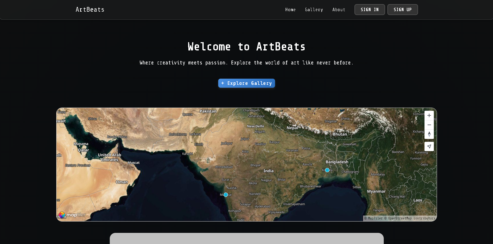
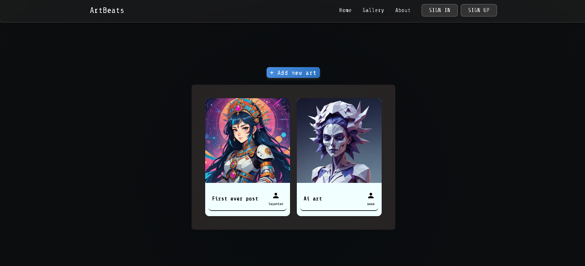
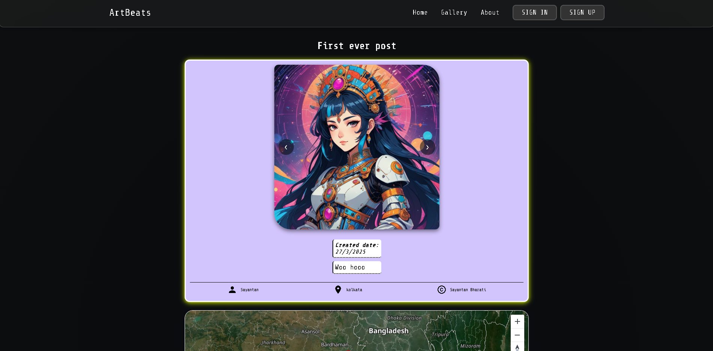
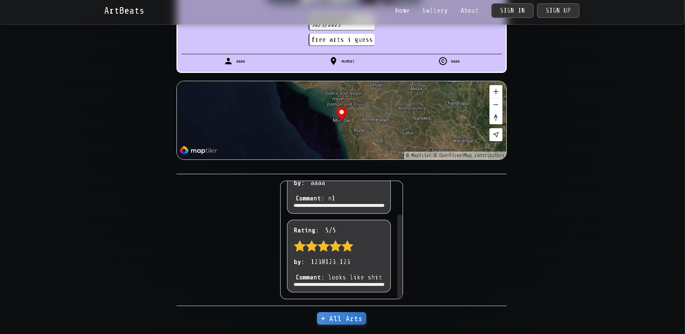

# ArtBeats 🎵🎨

ArtBeats is a full‑stack Express + MongoDB web application built for sharing, discovering, and interacting with art content. It uses server‑side rendering with **EJS**, secure authentication with **Passport**, session persistence via **MongoDB**, and a clean MVC‑style project structure.

---

## Tech Stack

**Backend**

* Node.js
* Express.js
* MongoDB Atlas
* Mongoose
* Passport.js (Local Strategy)
* express‑session + connect‑mongo

**Frontend**

* EJS (with ejs‑mate layouts)
* Vanilla JavaScript
* CSS (modular stylesheets)

**Security & Utilities**

* Helmet (CSP configured)
* express‑mongo‑sanitize
* method‑override
* connect‑flash
* dotenv

**External Services**

* Cloudinary (image uploads)
* MapTiler (maps)

---

## Project Structure

```
Lv3_ArtBeats/
├── app.js                 # Main application entry point
├── .env                   # Environment variables (not committed)
├── README.md
├── cloudinary/
│   └── index.js           # Cloudinary configuration
├── controllers/           # Route controllers (business logic)
│   ├── ArtBeatsController.js
│   ├── commentController.js
│   └── userController.js
├── models/                # Mongoose models
│   ├── ArtModel.js
│   ├── commentModel.js
│   └── userModel.js
├── routes/                # Express routes
│   ├── ArtBeatsRoutes.js
│   ├── commentRoutes.js
│   └── usersRoutes.js
├── middleware.js          # Custom middleware
├── schemas.js             # Joi validation schemas
├── seeds/                 # Database seed scripts
│   ├── index.js
│   └── seed.js
├── utils/                 # Utility helpers
│   ├── catchAsync.js
│   └── ExpressErrors.js
├── public/                # Static assets
│   ├── css/
│   ├── js/
│   └── images/
└── views/                 # EJS templates
    ├── layouts/
    ├── partials/
    ├── Arts/
    └── users/
```

---

## Features

* User authentication (register / login / logout)
* Secure password hashing
* Persistent sessions stored in MongoDB
* Create, edit, delete art posts
* Comment system on art posts
* Flash messages for UX feedback
* Server‑side form validation
* Image uploads via Cloudinary
* Map integration (MapTiler)
* Centralized error handling
* Production‑ready security middleware

---

## Environment Variables

Create a `.env` file in the root directory:

```
DB_URL=mongodb+srv://<username>:<password>@<cluster>.mongodb.net/ArtBeats?retryWrites=true&w=majority
SESSION_SECRET=your-session-secret
CLOUDINARY_CLOUD_NAME=your_cloud_name
CLOUDINARY_KEY=your_cloud_key
CLOUDINARY_SECRET=your_cloud_secret
MAPTILER_API_KEY=your_maptiler_key
```

> ⚠️ Never commit `.env` to version control.

---

## Installation & Setup

1. Clone the repository

   ```bash
   git clone <repo-url>
   cd Lv3_ArtBeats
   ```

2. Install dependencies

   ```bash
   npm install
   ```

3. Configure MongoDB Atlas

   * Create a cluster
   * Create a DB user
   * Whitelist your IP (or `/24` subnet for dev)

4. Add environment variables (`.env`)

5. Start the server

   ```bash
   nodemon app.js
   ```

6. Open in browser

   ```
   http://localhost:3000
   ```

---

## Seeding the Database (Optional)

If you want sample data:

```bash
node seeds/index.js
```

or

```bash
node seeds/seed.js
```







---

## Application Flow (High‑Level)

1. Request hits Express route
2. Route delegates to controller
3. Controller interacts with Mongoose models
4. Data is validated (Joi)
5. View is rendered via EJS
6. Session & auth handled by Passport

---

## Security Notes

* Sessions stored in MongoDB (connect‑mongo)
* Cookies are HTTP‑only
* Mongo query sanitization enabled
* Helmet CSP configured for external assets
* Passwords never stored in plain text

---

## Development Notes

* This is a **server‑rendered** app (not React / SPA)
* MVC‑style separation is intentional
* Controllers remain thin; models handle data
* Easily extendable to REST or API‑first architecture

---

## Future Improvements

* Pagination & search
* Role‑based access control
* Rate limiting
* Image optimization
* API version
* Production deployment (PM2 + Nginx)

---

## License

This project is for learning and portfolio purposes.

